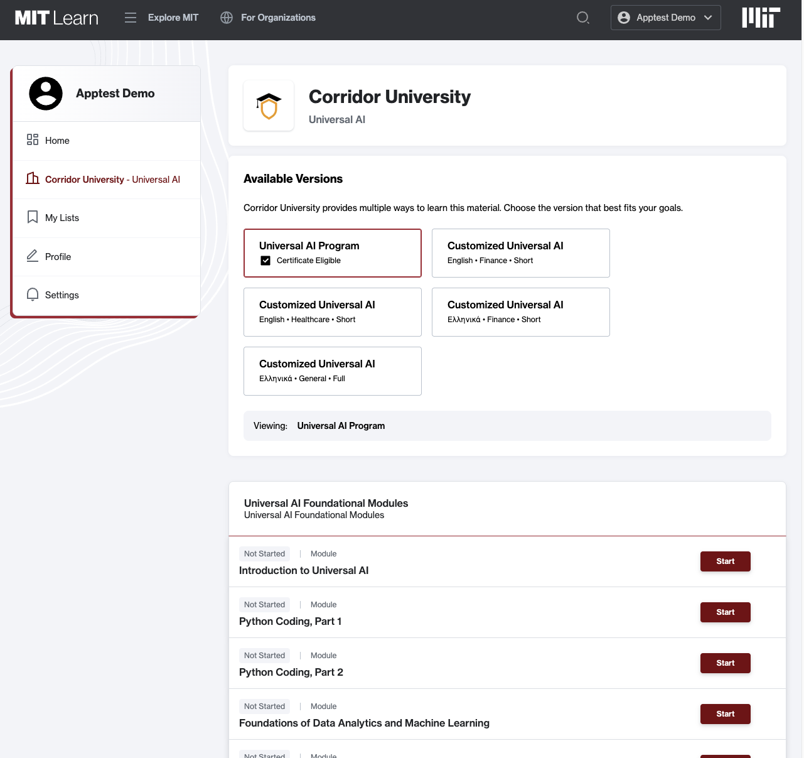
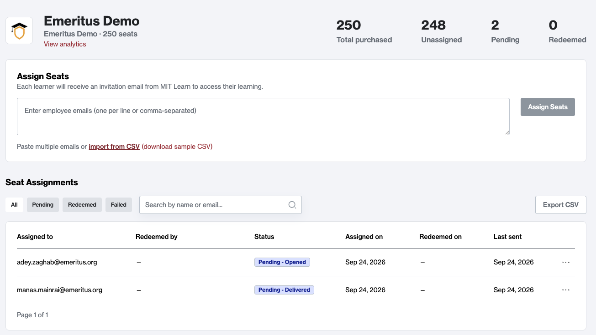

## An Overview Of
# Business-to-Business Sales

---

# Introduction

We sell certificate track enrollments for courses directly to individual customers. But we'd also like to sell blocks of enrollments to organizations - so the organization can pay for their members to earn a certificate.

xPRO has been doing this for a while. We needed something similar in functionality so we could roll out UAI to other organizations.

Notes:
- xPRO is focused on professional development offerings, so companies buy into it to offer courses to their employees.
- B2B and xPRO share similar goals but are structured very differently.

---

# Who Uses the System

3 kinds of clientele

    
<h3 style="text-align: center;">Other Institutions</h3>

Offering courseware to other educational institutions - the UAI use case

    
<h3 style="text-align: center;">Businesses</h3>

Access for employees - the xPRO use case

    
<h3 style="text-align: center;">Resellers</h3>

Offerings re-sold through other channels - opening additional markets

Notes:
- Resellers are pretty new
- Also adding "group buys" of B2C content (but will touch on that later)

---

# How It Works

B2B adds some new structures to MITx Online.

- **Organizations** provide a simple, top-level container for a B2B client, grouping together their users and courseware offerings
- **Contracts** define specific access - what courses and programs, how many seats, how users can access

It also adds in some new concepts for existing data.

- **Source runs** are special course runs that contain the course content but no enrollments, so they can be cloned and reused for customer-facing purposes
- **Contract runs** are course runs that are associated with (and available to) a particular contract

Setup starts with the contract (and org, if necessary). We add courseware to the contract, and then users can access it.

Notes:
- Orgs own contracts and can have as many as necessary.
- Contracts are named as such because they reference that we have a specific agreement with the org to provide content for users. We don't track that ourselves, though.

---

# Courseware in B2B

B2B contracts collect a set of courseware together to offer to the people associated with it. We do this by adding the courseware to the contract - usually a program.

Also, we (usually) want to give B2B customers their own spaces - so, we make contract runs for any course that was added to the contract.

Contract runs:

<ul>
<li class="fragment" data-fragment-index="1">Are cloned from the designated source run for the course</li>
<li class="fragment" data-fragment-index="2">Are attached to the contract</li>
<li class="fragment" data-fragment-index="3">Are (usually) marked as B2B-only, and aren't available for enrollment by the public</li>
</ul>

Users can see what's available to them from their Learn dashboard.

Notes:
- Enrollment in B2B runs is gated so the public can't get to them. No contract = no enrollment.

---

# Access Control

We need to be able to identify which users are allowed to access contract content. We do this by adding them to the organization and to individual contracts.

Users need to be in the organization first. They can do this in one of two ways:

### SSO Login

We can set up federation between Keycloak on our end and the org's login system. Users are added to the organization when they log in.

### Enrollment Code

We can send the user an enrollment code for a contract. Redeeming it grants the user access to the contract and the org.

Notes:
- We can also match the user on email domain - usually we do this to send to the IdP.

---

# Access Control

Once the user is in the organization, they may have access to one or more contracts. Contracts have a "membership type", which determines how users can gain access to the contract. There are two types:

<ul>
<li class="fragment" data-fragment-index="1">

The `managed` type grants **all** users within the ogranization access to the contract. If a user is in the org but not in the contract, they are added to it.

</li>
<li class="fragment" data-fragment-index="2">

The `code` type requires an **enrollment code** to access the contract. Redeeming the code adds you to the org if you're not already in it.

</li>
</ul>

Contracts can have further limits. We can set a seat limit, which limits the number of people that can redeem enrollment codes for access. We can also specify a start and end date for the contract.

Notes:
- The seat limit is used mostly for code contracts. We can have code contracts without seat limits but it means we can't effectively restrict access to the contract.
- We can also require users to pay for access. We haven't used this but it is there.

---

# Using the Resources

The Learn dashboard lists the contracts you have access to. Clicking into one shows you what courses - and customizations - you have available, and lets you continue on your learning journey.

Clicking on a course's Start button runs you through the verification process and enrolls you in the course. You receive a _verified_ enrollment, so (if the course offers it) you receive a certificate at the end of the course, if eligible.

Notes:
- Just showing the interior contract dash.

---

# Gating Resources

We use enrollment codes to allow access to `code` type contracts (and their organizations). But we also use them to gate access to the course runs themselves.

Clicking the Start button kicks off a process that involves the ecommerce system.

%%{init: {
    'theme': 'light'
}%%
flowchart LR
  start["Start button clicked"];
  oneclick["1-Click Enroll API"];
  redeem["Enrollment code located/created"];
  order["Order created for run with enrollment code"];
  fulfillment["Fulfillment checks order, checks code
  and user, then processes enrollment"];
  delivery["User sent to
  course run"];
  start --> oneclick;
  oneclick --> redeem;
  redeem --> order;
  order --> fulfillment;
  fulfillment --> delivery;

Ecommerce already knows how to check eligibility and create verified enrollments. So, when we add course runs, we create products too - clicking Start from the dashboard essentially _buys_ the enrollment for you.

Notes:
- The order serves as a record that this was a B2B enrollment. Also helpful for finance, they can see what contract runs are actually in use.
- Ecommerce won't let you buy a B2B-only run without an appropriate discount attached to the order.
- Not only B2B verification - since (for seat limited contracts) we'll run out of codes, we'll run out of codes and so we can't process any more orders.
- But not only those verifications - will ensure the export compliance check is run too.
- These orders are free so no actual payment processing happens, no money changes hands further.
- This process happens _for every B2B enrollment_, period.

---

# Customizations

We want to offer our B2B customers the ability to have our core content be customized for their purposes. So, we have three kinds of customizations:

<ul>
<li class="fragment" data-fragment-index="1">Language: we can translate content into other languages</li>
<li class="fragment" data-fragment-index="2">Industry focus: we can refactor the content to focus it on application within a particular industry (e.g. finance, health care)</li>
<li class="fragment" data-fragment-index="3">Length: we can refactor the content into short video summaries</li>
</ul>

We call these _variants_ and we offer some course content with combinations of these options. When we set up a contract, we can also capture what groups of options the customer wants, and they will get those courses automatically (if they exist).

Notes:
- We have a reasonable default of "English" and no other options.
- Variants can apply outside of B2B - but we don't use that as of yet. (This is more for translated content.)

---

# Self-serve Contract Management

We've recently added the ability to allow designated people within an org to manage their own contracts - they can send users invitations via email, see status, and perform other tasks.

Notes:
- Most of the work done by Danielle and Dan, maybe others?
- Invitees can be hand keyed or imported from a CSV file
- We can track the status of the email itself too - if an invitee never opens the email, we can pull their invite
- We designate specific people in the org as "managers", and they get access to this dashboard

---

# Future features

Some things on the horizon:

    
### Updated Provisioning Workflow

Setting up a contract is complicated; requiring coordination between several people, lots of commands to run, easy to make mistakes. A new process is being developed to streamline it and fix some issues with provisioning.

    
### Self-serve analytics

Compliments the manager dash - displays data about contract utiliziation and learner success, and adds in some data sharing consent functionality for contract members.

    
### Multi-contract course runs

Allows course runs to be shared amongst contracts - including _public_ runs, so we can essentially support "group buys" of enrollments for regular content.

Notes:
- Provisioning workflow - being driven by Tobias
- Self-serve analytics - cross-discipline (but mainly Danielle, Chris C, Carey?)
- Multi-contract - me

---

## The End Of An Overview Of
# Business-to-Business Sales

### Thanks for listening!
